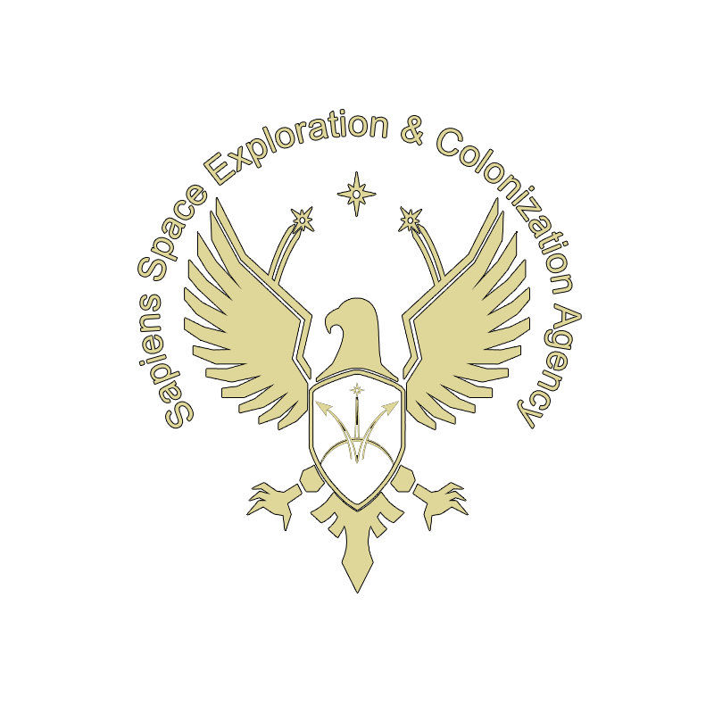

# Sapiens Space Exploration & Colonization Agency Game Design Document

## Overview

### Exploration & Colonization

The Sapiens Space Exploration & Colonization Agency (SSECA) is a groundbreaking space exploration game that brings together cutting-edge technologies and blockchain integration to create a living, breathing Metaverse. Players embark on a cosmic journey, exploring new worlds, building colonies, and interacting with diverse alien civilizations.

## The Galaxy Awaits

Join the expeditionary forces in their exploration of new worlds. Travel through star systems, encountering alien civilizations, making friends, and defending colonies. Discover technologies, explore further into space, and beware of dangerous anomalies.

## Your Path to the Stars

Enlist with the Sapiens Security Force (SSF) or join a corporation to start your galactic life. Complete training, embark on off-world expeditions, and build your galactic empire. Acquire ships, start companies, trade goods, mine resources, colonize planets, or take on dangerous missions. Your choices shape your destiny in the vast cosmos.

## A Living Metaverse Space-Simulation

### New Life

Citizens start on Earth, enlisting with SSF or corporations. Choose a career path, complete training, and progress through enlistment terms. Acquire ships, land, and major items as NFTs, tradeable on the Galactic market. Exploration leads to staking claims for mining, farming, and development.

### Exploration

Explore and colonize planets as a pathfinder or take on contract missions. Encounter other citizens, pirates, and alien species. Captain or crew deep-space ships, discover celestial and terrestrial assets, and stake claims for resource development.

### Your Empire

Exploration unveils profitable opportunities. Discover faster Celestial Star Paths, trade resources, and build your wealth. From trading raw materials to crafting ship components, SSECA offers diverse career paths. The game's foundation lies in exploration, colonization, and resource development.

## DAO & Governance

The Sapiens Galactic Alliance (SGA) is a decentralized autonomous organization governing SSECA. Token holders propose and vote on policies, and a High Tribunal enforces the constitution. Individual settlements can self-organize, forming factions, businesses, and contributing to the evolving SSECA Metaverse.

## Constitution

### Rights & Citizenship

- Fundamental Rights and Freedoms
- Purpose and Objectives
- Criteria and Responsibility of Citizenship

### Governing Tribunal & Elections

- Composition of Tribunal
- Tribunal role and responsibilities
- Tribunal authority
- Eligibility and voting process

### Citizen and Colony Organizations

- Authority and requirements
- Policies, Laws, and Enforcement
- Amendments & Ratification

## White-Paper

### Executive Summary

This white paper outlines SSECA's journey, combining Unreal Engine's immersive gameplay with a application-specific blockchain, crafted using Polygon CDK for decentralized asset ownership. The game, spanning from Q4 2023, introduces FPS exploration, blockchain integration, and decentralized governance through DAOs.

### Metaverse Development

#### Regular Feature Upgrades

- Player-centric development
- Community votes for feature implementation
- Minimum 60% vote for new features

#### Virtual Land Expansions

- Procedural generation of new planets and regions

#### Community-Governed Developments and Events

- Community governance for shaping the game's future

### Game Development

#### Procedural Generation

- Procedurally generated planets, asteroids, and species

#### Space Flight and Combat Mechanics

- Realistic space flight and combat for immersion

#### Resource Gathering, Trade, and Crafting Systems

- Robust resource systems and in-game and decentralized marketplaces

#### Colony Simulation Systems

- Player-governed colonies with political and economic depth

#### Artificial Intelligence

- Advanced AI for non-player species and colonies

#### Multiplayer Integration and Networking

- Robust matchmaking for PvP events and seamless multiplayer

### Blockchain Integration

#### Application-specific blockchain - Polygon CDK

- High throughput and low transaction fees

#### In-Game Currency and Economy

- Community-governed in-game economy

#### Traceability of In-Game Assets

- Tokenization of in-game assets on Polygon and the App-chain

#### On-Chain Governance

- Community-driven constitution and governance

#### P2P Resource Exchange

- Peer-to-peer resource exchange

#### Crypto Wallet Integration

- Secure storage and trading of in-game assets

#### NFT Certificates for Achievements

- Showcase accomplishments on the blockchain

### Cost of Citizenship

#### Certificate of Citizenship

- NFT Certificate cost determined by the community
- Solely used to fund game development

## Conclusion

This living document outlines SSECA's vision for a player-driven Metaverse. By leveraging Unreal Engine and the Polygon CDK, SSECA aims to create a decentralized, immersive space exploration experience. The development plan encompasses gameplay, metaverse development, game development, and blockchain integration, ensuring a vibrant, evolving, and decentralized SSECA Metaverse.

_Note: This document is a living document and will be updated as development progresses._
